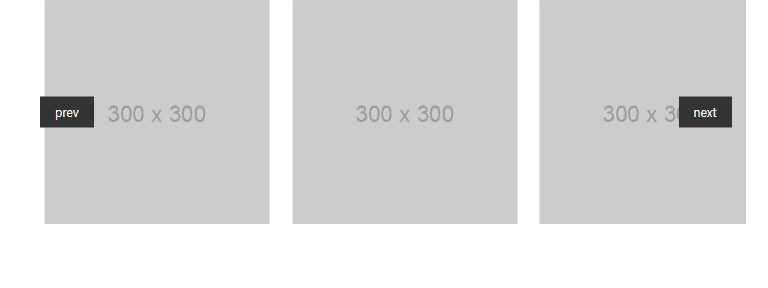
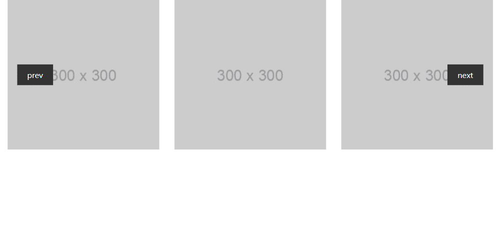
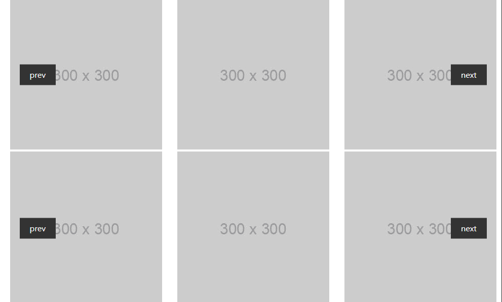

# javascript-slide-library
자바스크립트로 구현한 슬라이드 레포지토리입니다. 
(추후 라이브러리 개발용)

 

### **example1** - 슬라이드가 처음/마지막일 때 이동 버튼 숨김처리

---
 
    
### **example2** - 슬라이드가 처음/마지막이여도 다음 슬라이드 노출 (Loop)

---
 

### **example3** - 자동 슬라이드, 페이저 버튼 구현

---
 

### **example4** - 멀티 슬라이드, 하나씩 이동하는 슬라이드 구현
### **example5** - example4 무한 반복 (Loop), 자동 슬라이드 구현

---
 

### **example6** - example5 반응형 슬라이드로 구현

---
 

### **example7** - example6 모듈화 (slide.js)

